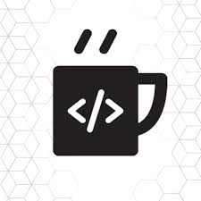

# tugas_niomic
<h1 align="center">Tugas Niomic</h1>

tugas tugas niomic <a href="https://niomic.com/">Niomic</a>.

### 1. HTML
- [Tugas 1 HTML](https://github.com/fadjarrafi/tugas_1_html) - Meta Charset, Title, Meta Author, Keyword & Description, Meta Refresh dan Link Favicon.
- [Tugas 2 HTML](https://github.com/fadjarrafi/tugas_2_html) - Heading Element, Comment.
- [Tugas 3 HTML](https://github.com/fadjarrafi/tugas_3_html) - Icon Favicon, Heading, Element Paragraph.
- [Tugas 4 HTML](https://github.com/fadjarrafi/tugas_4_html) - Anchor Element, Align Paragraph.
- [Tugas 5 HTML](https://github.com/fadjarrafi/tugas_5_html) - Format Element.
- [Tugas 6 HTML](https://github.com/fadjarrafi/tugas_6_html) - Ordered list, Unordered list, Description list.
- [Tugas 7 HTML](https://github.com/fadjarrafi/tugas_7_html) - Ordered list, Align Paragraph, Format Element.

### 2. Golang
- [Tugas 1 GOLANG](https://github.com/fadjarrafi/tugas_1_go) - Hello World!, menampilkan output nama.
- [Tugas 2 GOLANG](https://github.com/fadjarrafi/tugas_2_go) - Variabel, Operator, Seleksi Kondisi.
- [Tugas 3 GOLANG](https://github.com/fadjarrafi/tugas_3_go) - Perulangan, Array, Slice.
- [Tugas 4 GOLANG](https://github.com/fadjarrafi/tugas_4_go) - Map, Fungsi.
- [Tugas 5 GOLANG](https://github.com/fadjarrafi/tugas_5_go) - Struct.
- [Tugas 6 GOLANG](https://github.com/fadjarrafi/tugas_6_go) - Method, Private Dan Public.
- [Tugas 7 GOLANG](https://github.com/fadjarrafi/tugas_7_go) - Reflect, Goroutine.
- [Tugas 7 GOLANG](https://github.com/fadjarrafi/tugas_8_go) - Reflect, Goroutine.
- [Tugas 7 GOLANG](https://github.com/fadjarrafi/tugas_9_go) - Reflect, Goroutine.
- [Tugas 7 GOLANG](https://github.com/fadjarrafi/tugas_10_go) - Reflect, Goroutine.
- [Tugas 7 GOLANG](https://github.com/fadjarrafi/tugas_11_go) - Reflect, Goroutine.
- [Tugas 7 GOLANG](https://github.com/fadjarrafi/tugas_12_go) - Reflect, Goroutine.
- [Tugas 7 GOLANG](https://github.com/fadjarrafi/tugas_13_go) - Reflect, Goroutine.
- [Tugas 7 GOLANG](https://github.com/fadjarrafi/tugas_14_go) - Reflect, Goroutine.
- [Tugas 7 GOLANG](https://github.com/fadjarrafi/tugas_15_go) - Reflect, Goroutine.
- [Tugas 7 GOLANG](https://github.com/fadjarrafi/tugas_16_go) - Reflect, Goroutine.
- [Tugas 7 GOLANG](https://github.com/fadjarrafi/tugas_17_go) - Reflect, Goroutine.
- [Tugas 7 GOLANG](https://github.com/fadjarrafi/tugas_19_go) - Reflect, Goroutine.

